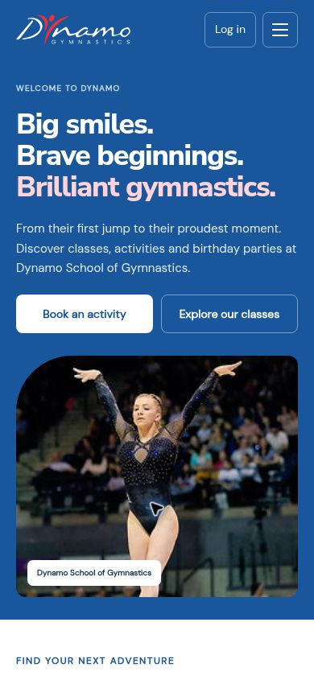

# Responsive design review — 10 October 2026

Replaced the public Wix snapshots with responsive HTML and a shared stylesheet. Public pages now use readable content flow, an accessible mobile menu, responsive images and local fonts. Member and management pages share the same typography and retain the existing authenticated APIs.

Verification on the deployed website:

- 112 browser layout checks: 13 public pages and 3 fictional account/booking/contacts layouts, each at 7 requested viewport widths (320, 360, 390, 430, 768, 1024 and 1440). Effective content widths account for the browser scrollbar and the desktop browser's maximum width. None had horizontal overflow after loading.
- Visually inspected homepage, mobile navigation, contacts cards and booking confirmation.
- Profile, wallet and booking dialogs fit a 400px-high viewport and scroll when their content is taller.
- Existing 46 automated tests pass; account, admin, booking and OTP DOM-flow checks pass.
- No real member records, purchases or emails were created or changed during these design checks.

Temporary browser-review pages and fictional fixtures were removed from the production tree after verification.

